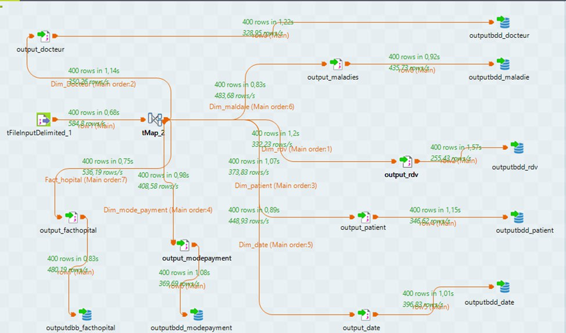

# Medical Data Warehouse Project

## 
The goal of this project is to build a decision support system using a data warehouse.  
We used ETL to extract, transform, and load data, then do OLAP analysis.

## ETL Job
Below is the Talend job used in this project:

## Work Done
- Created a star schema (fact table and dimensions)  
- Built ETL process using Talend  
- Loaded data into PostgreSQL data warehouse  
- Created OLAP cube  
- Performed analysis   

## Tools
- Talend Open Studio  
- PostgreSQL  
- Pentaho  
- SQL  

## Files
- Database (raw and output)  
- Talend job  
- Project report  
 

